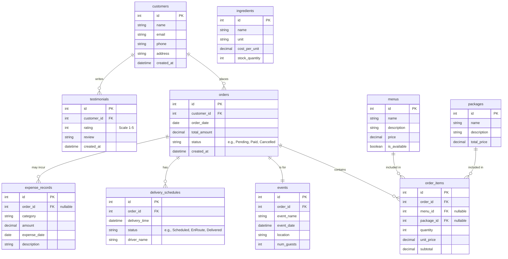

# Product Requirements Document (PRD) - Sistem Catering

## 1. Ringkasan Eksekutif & Latar Belakang
**Nama Produk:** Sistem Informasi Manajemen Catering
**Visi:** Menyediakan platform terpadu untuk mempermudah operasional harian bisnis catering, dari manajemen pemesanan hingga keuangan.

**Masalah (Problem Statement):**
Usaha catering saat ini kesulitan dalam mengelola operasional yang masih terfragmentasi. Mulai dari pencatatan pesanan event yang manual, penawaran paket menu yang tidak fleksibel, pengaturan jadwal pengiriman yang rawan miskomunikasi, serta minimnya pencatatan terhadap pengeluaran operasional dan inventaris bahan baku. Hal ini seringkali berujung pada perhitungan laba rugi yang kurang presisi dan menurunnya kepuasan pelanggan.

**Solusi:**
Membangun sebuah sistem terintegrasi (*end-to-end*) yang mampu menangani seluruh siklus bisnis catering. Sistem ini mencakup manajemen katalog (menu dan paket), pemesanan oleh klien, pengaturan logistik pengiriman, pencatatan bahan makanan, serta rekapitulasi laporan pendapatan, pengeluaran, dan performa dari ulasan pelanggan.

---

## 2. Target Pengguna (User Personas)
Aplikasi ini memiliki tiga kelompok pengguna utama:
1. **Pemilik Catering (Owner / Admin):** Memerlukan akses menyeluruh terhadap performa bisnis. Mampu melihat laporan pesanan, ringkasan pendapatan, manajemen keuangan (pengeluaran), serta memantau keseluruhan operasional dan testimoni klien.
2. **Staf Operasional (Staff / Logistik):** Membutuhkan akses untuk memperbarui ketersediaan bahan baku, melihat detail rincian pesanan (*order_items*) untuk persiapan dapur, dan mengatur serta melacak status penjadwalan pengiriman makanan ke lokasi acara.
3. **Klien (Customer):** Membutuhkan akses (atau tampilan publik) untuk mengeksplorasi katalog menu dan paket, melakukan pemesanan untuk event khusus (seperti pernikahan, rapat kantor), dan memberikan ulasan (testimoni) setelah acara selesai.

---

## 3. Spesifikasi Fungsional (Fitur Utama)

| Fitur Utama | Deskripsi Fungsional & Kriteria Penerimaan | Aktor |
| :--- | :--- | :--- |
| **Katalog Menu & Paket** | Modul untuk manajemen daftar menu satuan dan paket catering. Pengguna dapat menambah, mengubah, dan menghapus item beserta harga, foto, dan status ketersediaan. | Admin |
| **Pemesanan Acara (Event Ordering)** | Fasilitas pembuatan pesanan yang terintegrasi dengan detail event (tanggal acara, lokasi, jumlah tamu). Mendukung kalkulasi harga otomatis berdasarkan menu/paket yang dipilih. | Klien, Admin |
| **Penjadwalan Pengiriman** | Fitur untuk mengatur jadwal logistik/pengiriman untuk setiap pesanan. Memungkinkan pelacakan status (Mis: Menunggu Jadwal, Dalam Perjalanan, Terkirim). | Staf |
| **Manajemen Bahan & Biaya** | Modul pencatatan inventaris bahan baku (*ingredients*) dan pergerakan stok untuk estimasi pengadaan kebutuhan produksi. | Staf, Admin |
| **Pengeluaran Operasional** | Pencatatan rekam pengeluaran (*expense_records*) operasional (mis: listrik, gaji, bahan bakar). Pengeluaran bisa bersifat umum atau dikaitkan pada pesanan tertentu. | Admin |
| **Testimoni & Ulasan** | Fungsionalitas bagi pelanggan untuk meninggalkan rating dan ulasan teks atas layanan pesanan yang telah diselesaikan. | Klien |
| **Laporan & Dasbor** | Tampilan dasbor rekapitulasi dan visualisasi dari total pesanan, pendapatan bulanan, dan total pengeluaran untuk perhitungan profitabilitas. | Admin |

---

## 4. Arsitektur & Skema Data

### 4.1 Penjelasan Naratif
Arsitektur database relasional Sistem Catering ini dirancang agar setiap entitas data terkait secara logis, memastikan integritas pencatatan transaksi dan operasional:
- **`customers`:** Entitas yang menyimpan data diri klien. Satu pelanggan (customer) dapat melakukan banyak pesanan (`orders`) dan menulis banyak ulasan (`testimonials`).
- **`menus` & `packages`:** Keduanya merupakan master data untuk produk yang ditawarkan. Entitas ini dihubungkan pada tabel detail transaksi.
- **`orders` & `order_items`:** `orders` adalah *header* transaksi (total harga, tanggal pesanan, status), sedangkan `order_items` menyimpan detail per baris atas produk apa saja (mengambil dari tabel `menus` dan/atau `packages`) yang dibeli beserta sub-totalnya.
- **`events`:** Entitas berelasi *one-to-one* (atau spesifik) terhadap `orders`. Menyimpan metadata detail tentang acara yang diadakan, yaitu nama acara, lokasi, waktu pelaksaan, dan estimasi jumlah tamu.
- **`delivery_schedules`:** Menyimpan informasi logistik dan penjadwalan. Terhubung dengan `orders` untuk memastikan makanan diantar tepat waktu, berisi informasi nama kurir dan status antar.
- **`ingredients`:** Katalog master untuk daftar bahan mentah, mencakup harga beli dan sisa stok untuk manajemen dapur.
- **`expense_records`:** Mencatat segala arus kas keluar pengeluaran bisnis. Tabel ini memiliki koneksi (*Foreign Key* opsional) ke tabel `orders` yang memungkinkan sistem mengatribusikan pengeluaran khusus secara langsung kepada suatu event.
- **`testimonials`:** Tabel penyimpan rating dan komentar, terkait dengan ID pelanggan.

### 4.2 Entity Relationship Diagram (ERD)

---

## 5. Non-Functional Requirements (Kebutuhan Non-Fungsional)
1. **Keamanan (Security):** Autentikasi dan autorisasi pengguna secara ketat melalui implementasi Role-Based Access Control (RBAC). Data kata sandi (*password*) pengguna wajib di-hash menggunakan algoritma modern (seperti bcrypt/Argon2).
2. **Kinerja (Performance):** Sistem harus dioptimalkan untuk memuat halaman, termasuk penyajian kalkulasi laporan dan dasbor, dalam waktu di bawah 3 detik.
3. **Ketersediaan (Availability & Backup):** Diperlukan *backup* database otomatis dan harian demi menghindari hilangnya data krusial terkait pesanan dan finansial.
4. **Responsivitas UI/UX:** Antarmuka harus *mobile-friendly* dan responsif (mengakomodasi desktop dan mobile). Hal ini khususnya diperlukan agar Staf Logistik dapat melakukan *update* status pengiriman dengan mudah langsung dari gawai (HP) mereka di lokasi.
